<!-- ╔══════════════════════════════════════════════════════════════╗ -->
<!-- ║                    BANNIÈRE PRINCIPALE                       ║ -->
<!-- ╚══════════════════════════════════════════════════════════════╝ -->

<div align="center">
  


</div>

<!-- ╔══════════════════════════════════════════════════════════════╗ -->
<!-- ║                    EFFET TYPING                              ║ -->
<!-- ╚══════════════════════════════════════════════════════════════╝ -->

<div align="center">
  
[](https://git.io/typing-svg)

</div>

<!-- ╔══════════════════════════════════════════════════════════════╗ -->
<!-- ║                    BADGES PROFIL                             ║ -->
<!-- ╚══════════════════════════════════════════════════════════════╝ -->

<div align="center">
  


</div>

<br/>

<!-- ╔══════════════════════════════════════════════════════════════╗ -->
<!-- ║                    À PROPOS DE MOI                           ║ -->
<!-- ╚══════════════════════════════════════════════════════════════╝ -->

## 🚀 À propos de moi


```javascript
const johary = {
    pseudo: "joharymanantena1-ux",
    role: "Développeur Fullstack",
    location: "Madagascar 🇲🇬",
    education: "Sciences Informatiques",
    
    languages: ["Français", "Malgache", "English"],
    
    currentlyLearning: ["React Native", "GraphQL", "Cloud"],
    
    askMeAbout: ["JavaScript", "React", "Node.js", "UX/UI"],
    
    funFact: "Photographe amateur & graphiste 📸🎨",
    
    motto: "Le code est de la poésie qui résout des problèmes."
};
```

<br/>

### 🎯 Ce qui me définit

- 🔭 **Actuellement** : J'apprends **React Native** et **GraphQL** pour étendre mes compétences
- 🌱 **En développement** : Mes compétences en **architecture logicielle** et **DevOps**
- 💡 **Passionné par** : Création d'interfaces intuitives et expériences utilisateur fluides
- 🎨 **Double casquette** : Développeur le jour, photographe & graphiste à mes heures perdues
- 🤝 **Ouvert à** : Collaborations sur projets open-source et opportunités freelance
- 📫 **Contact** : [andrianmanantena@gmail.com](mailto:andrianmanantena@gmail.com)

<br clear="right"/>

---

<!-- ╔══════════════════════════════════════════════════════════════╗ -->
<!-- ║                    POINTS FORTS                              ║ -->
<!-- ╚══════════════════════════════════════════════════════════════╝ -->

## ✨ Mes atouts

<table align="center">
  <tr>
    <td align="center" width="33%">
      <h3>🚀</h3>
      <b>Esprit d'innovation</b>
      <br/><br/>
      <sub>Toujours à l'affût des dernières technologies et des meilleures pratiques pour livrer un code de qualité.</sub>
    </td>
    <td align="center" width="33%">
      <h3>🎨</h3>
      <b>Sens du design</b>
      <br/><br/>
      <sub>Mon background en graphisme me permet de créer des interfaces esthétiques et fonctionnelles.</sub>
    </td>
    <td align="center" width="33%">
      <h3>🧠</h3>
      <b>Apprentissage rapide</b>
      <br/><br/>
      <sub>Capacité à m'adapter rapidement à de nouveaux frameworks et environnements de travail.</sub>
    </td>
  </tr>
  <tr>
    <td align="center" width="33%">
      <h3>🤝</h3>
      <b>Esprit d'équipe</b>
      <br/><br/>
      <sub>Collaboration efficace, communication claire et partage des connaissances.</sub>
    </td>
    <td align="center" width="33%">
      <h3>⚡</h3>
      <b>Résolution de problèmes</b>
      <br/><br/>
      <sub>Approche méthodique et créative pour transformer les défis en opportunités.</sub>
    </td>
    <td align="center" width="33%">
      <h3>📚</h3>
      <b>Curiosité technique</b>
      <br/><br/>
      <sub>Veille constante sur les évolutions du web et exploration de nouveaux concepts.</sub>
    </td>
  </tr>
</table>

<br/>

---

<!-- ╔══════════════════════════════════════════════════════════════╗ -->
<!-- ║                    COMPÉTENCES PROGRESSION                   ║ -->
<!-- ╚══════════════════════════════════════════════════════════════╝ -->

## 📊 Niveau de compétences

<div align="center">

| Domaine | Niveau | Progression |
|---------|--------|-------------|
| 🎨 **Frontend (React, Vue, Next.js)** | Avancé |  |
| ⚙️ **Backend (Node.js, Laravel, Django)** | Intermédiaire+ |  |
| 🗄️ **Bases de données (SQL & NoSQL)** | Avancé |  |
| 📱 **Mobile (React Native, Flutter)** | Intermédiaire |  |
| 🎨 **UX/UI Design (Figma)** | Avancé |  |
| 🚀 **DevOps (Docker, CI/CD)** | Intermédiaire |  |
| ☁️ **Cloud (AWS, Firebase)** | Intermédiaire |  |

</div>

<br/>

---

<!-- ╔══════════════════════════════════════════════════════════════╗ -->
<!-- ║                    STACK TECHNIQUE                           ║ -->
<!-- ╚══════════════════════════════════════════════════════════════╝ -->

## 🛠️ Stack technique complète

<div align="center">

### 💻 Langages de programmation
<p>

</p>

### 🎨 Frontend & Frameworks
<p>

</p>

### ⚙️ Backend & Runtime
<p>

</p>

### 🗄️ Bases de données
<p>

</p>

### 🚀 DevOps & Cloud
<p>

</p>

### 🧰 Outils & Design
<p>

</p>

</div>

<br/>

---

<!-- ╔══════════════════════════════════════════════════════════════╗ -->
<!-- ║                    STATISTIQUES GITHUB                       ║ -->
<!-- ╚══════════════════════════════════════════════════════════════╝ -->

## 📈 Statistiques GitHub

<div align="center">

<a href="https://github.com/joharymanantena1-ux">
  
</a>
<a href="https://github.com/joharymanantena1-ux">
  
</a>

<br/><br/>

<a href="https://github.com/joharymanantena1-ux">
  
</a>

<br/><br/>

<a href="https://github.com/joharymanantena1-ux">
  
</a>

</div>

<br/>

---

<!-- ╔══════════════════════════════════════════════════════════════╗ -->
<!-- ║                    OBJECTIFS / FOCUS                         ║ -->
<!-- ╚══════════════════════════════════════════════════════════════╝ -->

## 🎯 Mes objectifs

<div align="center">

<table>
  <tr>
    <td align="center" width="50%" valign="top">
      <h3>🎓 Court terme</h3>
      <ul align="left">
        <li>Maîtriser <b>React Native</b> pour le développement mobile</li>
        <li>Approfondir <b>GraphQL</b> et les APIs modernes</li>
        <li>Réussir mes études en sciences informatiques</li>
        <li>Contribuer à des projets <b>open-source</b></li>
      </ul>
    </td>
    <td align="center" width="50%" valign="top">
      <h3>🚀 Long terme</h3>
      <ul align="left">
        <li>Devenir un <b>développeur fullstack senior</b></li>
        <li>Lancer mon propre <b>studio digital</b></li>
        <li>Maîtriser le <b>cloud computing</b> (AWS / GCP)</li>
        <li>Mentorer la prochaine génération de devs</li>
      </ul>
    </td>
  </tr>
</table>

</div>

<br/>

---

<!-- ╔══════════════════════════════════════════════════════════════╗ -->
<!-- ║                    DOMAINES D'EXPERTISE                      ║ -->
<!-- ╚══════════════════════════════════════════════════════════════╝ -->

## 💼 Domaines d'expertise

<div align="center">

<table>
  <tr>
    <td align="center" width="25%">
      <h2>🌐</h2>
      <b>Web Development</b>
      <br/><br/>
      <sub>Sites vitrines, applications web, e-commerce, dashboards admin</sub>
    </td>
    <td align="center" width="25%">
      <h2>📱</h2>
      <b>Mobile Apps</b>
      <br/><br/>
      <sub>Applications cross-platform avec React Native et Flutter</sub>
    </td>
    <td align="center" width="25%">
      <h2>🎨</h2>
      <b>UX/UI Design</b>
      <br/><br/>
      <sub>Maquettes Figma, prototypage, design system</sub>
    </td>
    <td align="center" width="25%">
      <h2>🔌</h2>
      <b>API & Backend</b>
      <br/><br/>
      <sub>APIs REST/GraphQL, authentification, microservices</sub>
    </td>
  </tr>
</table>

</div>

<br/>

---

<!-- ╔══════════════════════════════════════════════════════════════╗ -->
<!-- ║                    CITATION                                  ║ -->
<!-- ╚══════════════════════════════════════════════════════════════╝ -->

## 💭 Citation du jour

<div align="center">


</div>

<br/>

---

<!-- ╔══════════════════════════════════════════════════════════════╗ -->
<!-- ║                    SOFT SKILLS                               ║ -->
<!-- ╚══════════════════════════════════════════════════════════════╝ -->

## 🌟 Soft Skills

<div align="center">

| 🧩 **Compétence** | 📝 **Description** |
|:---:|:---|
| 🎯 **Rigueur** | Code propre, bien commenté, respect des bonnes pratiques |
| 🔄 **Adaptabilité** | Capacité à changer rapidement de contexte ou de technologie |
| 💬 **Communication** | Expliquer des concepts techniques de manière claire et accessible |
| ⏰ **Gestion du temps** | Respect des deadlines, priorisation efficace des tâches |
| 🎨 **Créativité** | Approche artistique appliquée au développement et au design |
| 👂 **Écoute active** | Comprendre les besoins réels du client avant de coder |
| 🧘 **Patience** | Persévérance face aux bugs complexes et aux défis techniques |
| 🌱 **Curiosité** | Envie d'apprendre constante, veille technologique active |

</div>

<br/>

---

<!-- ╔══════════════════════════════════════════════════════════════╗ -->
<!-- ║                    PROCESSUS DE TRAVAIL                      ║ -->
<!-- ╚══════════════════════════════════════════════════════════════╝ -->

## ⚙️ Mon processus de travail

```mermaid
graph LR
    A[💡 Idée] --> B[📋 Analyse]
    B --> C[🎨 Maquette]
    C --> D[💻 Développement]
    D --> E[🧪 Tests]
    E --> F[🚀 Déploiement]
    F --> G[🔄 Maintenance]
    
    style A fill:#4A90E2,stroke:#fff,color:#fff
    style B fill:#8E44AD,stroke:#fff,color:#fff
    style C fill:#F39C12,stroke:#fff,color:#fff
    style D fill:#27AE60,stroke:#fff,color:#fff
    style E fill:#E74C3C,stroke:#fff,color:#fff
    style F fill:#16A085,stroke:#fff,color:#fff
    style G fill:#2C3E50,stroke:#fff,color:#fff
```

<div align="center">



</div>

<br/>

---

<!-- ╔══════════════════════════════════════════════════════════════╗ -->
<!-- ║                    CONTACT                                   ║ -->
<!-- ╚══════════════════════════════════════════════════════════════╝ -->

## 📬 Connectons-nous !

<div align="center">

<a href="mailto:andrianmanantena@gmail.com">
  
</a>
<a href="https://www.linkedin.com/in/johary-manantena">
  
</a>
<a href="https://github.com/joharymanantena1-ux">
  
</a>

<br/><br/>

💼 **Disponible pour** : Stages • Projets freelance • Collaborations open-source • Opportunités fullstack

</div>

<br/>

---

<!-- ╔══════════════════════════════════════════════════════════════╗ -->
<!-- ║                    PIED DE PAGE                              ║ -->
<!-- ╚══════════════════════════════════════════════════════════════╝ -->

<div align="center">

### 💖 Merci de votre visite !

[](https://git.io/typing-svg)

<br/>


</div>
