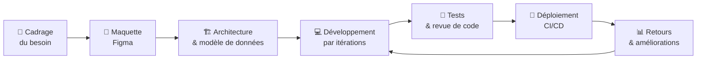

<!-- ═══════════════════════════════════════════════════════════════ -->
<!--                        HEADER / BANNIÈRE                       -->
<!-- ═══════════════════════════════════════════════════════════════ -->

<div align="center">


<a href="https://github.com/joharymanantena1-ux">
  
</a>

<br/>

<!-- Liens de contact -->
<a href="mailto:andrianmanantena@gmail.com">
  
</a>
<a href="https://github.com/joharymanantena1-ux">
  
</a>
<a href="#">
  
</a>
<a href="#">
  
</a>

<br/><br/>


</div>

---

<!-- ═══════════════════════════════════════════════════════════════ -->
<!--                          À PROPOS                              -->
<!-- ═══════════════════════════════════════════════════════════════ -->

## 👋 À propos de moi

Je suis **Johary Manantena**, développeur fullstack et étudiant en sciences informatiques à Madagascar.
Je conçois des applications web et mobiles de bout en bout : de la maquette Figma jusqu'au déploiement en production.
Mon parcours de graphiste me donne un œil particulier sur l'interface — je ne livre pas seulement du code qui marche, mais des produits agréables à utiliser.

```javascript
const johary = {
  pseudo:      "joharymanantena1-ux",
  role:        "Développeur Fullstack & UI/UX",
  localisation:"Antananarivo, Madagascar 🇲🇬",
  formation:   "Licence — Sciences Informatiques",
  langues:     ["Malagasy", "Français", "English"],
  stack:       ["React", "Next.js", "Node.js", "Laravel", "PostgreSQL"],
  apprentissage: ["React Native", "GraphQL", "AWS"],
  disponible:  true,
  devise:      "Le code est de la poésie qui résout des problèmes."
};
```

**En quelques points :**

- 🔭 Je développe actuellement des applications web full JavaScript et des APIs REST/GraphQL
- 🌱 J'approfondis **React Native**, **GraphQL** et l'**architecture cloud**
- 🎨 Double casquette : développeur le jour, photographe & graphiste le reste du temps
- 🤝 Ouvert aux collaborations open-source et aux missions freelance
- 📫 Contact direct : **andrianmanantena@gmail.com**
- ⚡ Fun fact : je prototype souvent dans Figma avant d'écrire la première ligne de code

---

<!-- ═══════════════════════════════════════════════════════════════ -->
<!--                         PARCOURS                               -->
<!-- ═══════════════════════════════════════════════════════════════ -->

## 🎓 Mon parcours

> 💡 *Remplacez les années, écoles et entreprises ci-dessous par vos informations exactes.*

### Formation

| Période | Formation | Établissement |
|:---|:---|:---|
| `2023 — aujourd'hui` | **Licence et Master en Sciences Informatiques** | *IT University* |

### Expérience & projets marquants

<table>
  <tr>
    <td valign="top" width="50%">
      <h4>💼 Développeur Freelance</h4>
      <sub><code>2023 — aujourd'hui</code></sub>
      <ul>
        <li>Sites vitrines et e-commerce pour des clients locaux</li>
        <li>Dashboards d'administration React + API Node.js</li>
        <li>Maquettage Figma et intégration pixel-perfect</li>
      </ul>
    </td>
    <td valign="top" width="50%">
      <h4>🎨 Graphiste & Photographe</h4>
      <sub><code>2021 — aujourd'hui</code></sub>
      <ul>
        <li>Identité visuelle, affiches, retouche photo</li>
        <li>Design systems et composants réutilisables</li>
        <li>Suite Adobe + Figma au quotidien</li>
      </ul>
    </td>
  </tr>
</table>

### Étapes clés

```text
2021  ●── Premiers pas : HTML, CSS, graphisme
2022  ●── JavaScript, PHP, premiers projets clients
2023  ●── Entrée en licence informatique · React & Node.js
2024  ●── Laravel, Django, bases de données avancées
2025  ●── Docker, CI/CD, déploiements cloud
2026  ●── React Native, GraphQL, open-source  ← me voici
```

---

<!-- ═══════════════════════════════════════════════════════════════ -->
<!--                      STACK TECHNIQUE                           -->
<!-- ═══════════════════════════════════════════════════════════════ -->

## 🛠️ Stack technique

<div align="center">

**Langages**


**Frontend**


**Backend & API**


**Mobile**


**Bases de données**


**DevOps & Cloud**


**Outils & Design**


</div>

---

<!-- ═══════════════════════════════════════════════════════════════ -->
<!--                   NIVEAU DE COMPÉTENCES                        -->
<!-- ═══════════════════════════════════════════════════════════════ -->

## 📊 Niveau de compétences

| Domaine | Niveau | Progression |
|:---|:---:|:---|
| 🎨 **Frontend** — React, Next.js, Vue | Avancé |  |
| 🖌️ **UX/UI Design** — Figma, Design System | Avancé |  |
| 🗄️ **Bases de données** — SQL & NoSQL | Avancé |  |
| ⚙️ **Backend** — Node.js, Laravel, Django | Intermédiaire + |  |
| ☁️ **Cloud** — AWS, Firebase, Vercel | Intermédiaire |  |
| 📱 **Mobile** — React Native, Flutter | Intermédiaire |  |
| 🚀 **DevOps** — Docker, CI/CD | Intermédiaire |  |

---

<!-- ═══════════════════════════════════════════════════════════════ -->
<!--                      PROJETS ÉPINGLÉS                          -->
<!-- ═══════════════════════════════════════════════════════════════ -->


---

<!-- ═══════════════════════════════════════════════════════════════ -->
<!--                   STATISTIQUES & CONTRIBUTIONS                 -->
<!-- ═══════════════════════════════════════════════════════════════ -->

## 📈 Statistiques GitHub

<div align="center">


<br/><br/>

<!-- Miroir Vercel : plus fiable que streak-stats.demolab.com qui tombe souvent -->


<br/><br/>


</div>

### 🏆 Trophées

<div align="center">
  
</div>

### 🐍 Graphe de contributions animé

<div align="center">

<picture>
  <source media="(prefers-color-scheme: dark)" srcset="https://raw.githubusercontent.com/joharymanantena1-ux/joharymanantena1-ux/output/github-snake-dark.svg" />
  <source media="(prefers-color-scheme: light)" srcset="https://raw.githubusercontent.com/joharymanantena1-ux/joharymanantena1-ux/output/github-snake.svg" />
  
</picture>

</div>

> ⚠️ Cette animation nécessite le workflow GitHub Actions fourni plus bas (`.github/workflows/snake.yml`). Sans lui, l'image ne s'affichera pas.

---

<!-- ═══════════════════════════════════════════════════════════════ -->
<!--                     PROCESSUS DE TRAVAIL                       -->
<!-- ═══════════════════════════════════════════════════════════════ -->

## ⚙️ Ma méthode de travail



**En pratique :** comprendre avant de coder, maquetter avant de construire, livrer petit et souvent, puis écouter les retours des utilisateurs.

---

<!-- ═══════════════════════════════════════════════════════════════ -->
<!--                   DOMAINES & SOFT SKILLS                       -->
<!-- ═══════════════════════════════════════════════════════════════ -->

## 💼 Ce que je peux faire pour vous

<table>
  <tr>
    <td align="center" width="25%"><h3>🌐</h3><b>Web Development</b><br/><br/><sub>Sites vitrines, e-commerce, applications métier, dashboards</sub></td>
    <td align="center" width="25%"><h3>📱</h3><b>Applications mobiles</b><br/><br/><sub>Cross-platform avec React Native et Flutter</sub></td>
    <td align="center" width="25%"><h3>🎨</h3><b>UX/UI Design</b><br/><br/><sub>Maquettes Figma, prototypage, design system complet</sub></td>
    <td align="center" width="25%"><h3>🔌</h3><b>API & Backend</b><br/><br/><sub>REST & GraphQL, authentification, microservices</sub></td>
  </tr>
</table>

## 🌟 Soft skills

| Compétence | Concrètement |
|:---|:---|
| 🎯 **Rigueur** | Code lisible, commenté, conventions respectées |
| 🔄 **Adaptabilité** | Changement de stack ou de contexte sans friction |
| 💬 **Communication** | Vulgariser le technique pour un client non technique |
| ⏰ **Gestion du temps** | Deadlines tenues, priorisation assumée |
| 👂 **Écoute active** | Comprendre le besoin réel avant d'ouvrir l'éditeur |
| 🧘 **Persévérance** | Les bugs difficiles ne me font pas fuir |

---

<!-- ═══════════════════════════════════════════════════════════════ -->
<!--                          OBJECTIFS                             -->
<!-- ═══════════════════════════════════════════════════════════════ -->

## 🎯 Mes objectifs

<table>
  <tr>
    <td valign="top" width="50%">
      <h3 align="center">🎓 Court terme</h3>
      <ul>
        <li>Maîtriser <b>React Native</b> en production</li>
        <li>Approfondir <b>GraphQL</b> et les APIs modernes</li>
        <li>Valider ma licence en sciences informatiques</li>
        <li>Publier 3 projets <b>open-source</b> utiles</li>
      </ul>
    </td>
    <td valign="top" width="50%">
      <h3 align="center">🚀 Long terme</h3>
      <ul>
        <li>Devenir <b>développeur fullstack senior</b></li>
        <li>Lancer mon propre <b>studio digital</b></li>
        <li>Certification <b>cloud</b> (AWS / GCP)</li>
        <li>Mentorer la prochaine génération de devs malagasy</li>
      </ul>
    </td>
  </tr>
</table>

---

<!-- ═══════════════════════════════════════════════════════════════ -->
<!--                        CONTACT / FOOTER                        -->
<!-- ═══════════════════════════════════════════════════════════════ -->

## 📬 Travaillons ensemble

<div align="center">

Un projet en tête, une question technique, ou simplement envie d'échanger ?
**Ma boîte mail est toujours ouverte.**

<br/>

<a href="mailto:andrianmanantena@gmail.com"></a>
<a href="#"></a>
<a href="#"></a>
<a href="#"></a>
<a href="#"></a>

<br/><br/>


<br/>

⭐️ *Si mon travail vous plaît, n'hésitez pas à laisser une étoile sur mes dépôts !*


</div>
